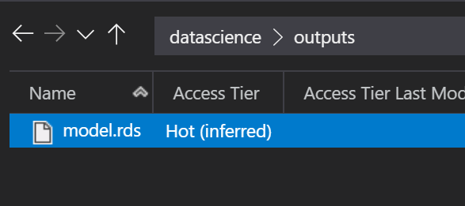
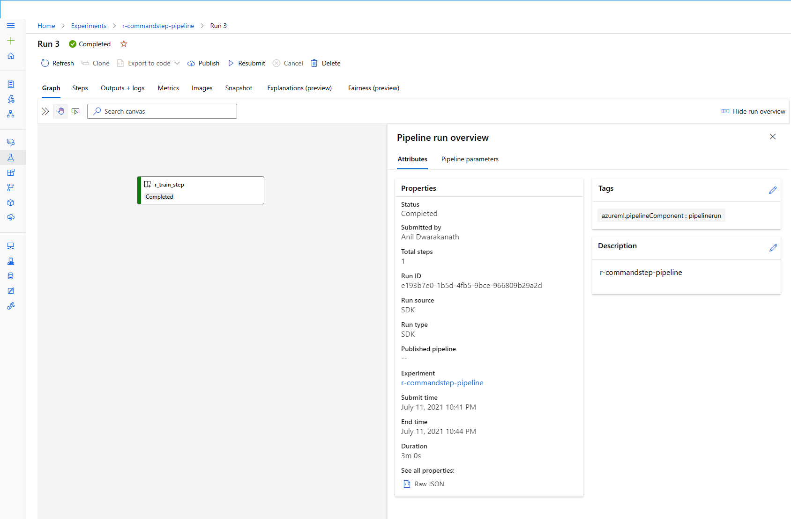
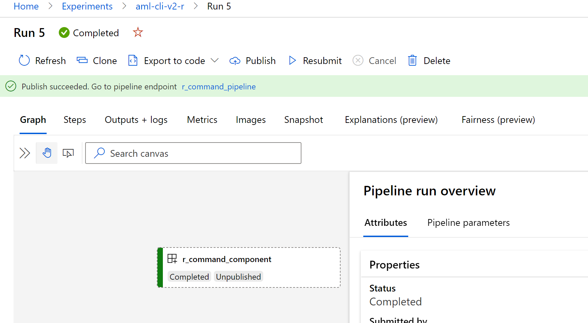

## ADLS Gen2 integration with R script using AML Compute Instance and AML CLI V2

Currently there is limited support for R script to integrate with ADLS Gen2 storage using MSI. This is an interim approach till MSI support is natively added to AML Compute Instance and Read/Write support for ADLS Gen2 in AML CLI 2.0.

### With AML CLI V2 - Batch mode

This section shows how we can use R script to read/write files from ADLS Gen2. Here the R script uses Service Principal and uses AzureStor R package to integrate with ADLS Gen2. We will use AML CLI V2.0 to submit R script as jobs to AML Compute Cluster. 

#### Prerequisites

- sample data file accidents.Rd from this repo uploaded to ADLS Gen2 container
- Service Principal and secret created in Azure Active Directory.
- The above Service Principal should be assigned Storage Blob Data Contributor role on the ADLS Gen2 container
- AML CLI V2 installed locally
- AML compute cluster provisioned.
- Modify AML compute cluster name job.yml
- Modify r1.env and update Service Principal, Client Secret, Tenant and ADLS Gen2 endpoint

The sample R script in src/adlsgen2.R run a prediction alogrithm by downloading the accidents.Rd files to local folder and runs the prediction alogrithm. The model is saved to outputs path in the container. 

Modify container name as shown below. The sample R script uses datascience as container name. 

        cont <- storage_container(ad_endp_tok2, "datascience")

Execute AML CLI job as shown below. 

        az ml job create -f job.yml --stream -g <resource group name> -w <azure machine learning workspace name>

The job should complete with the below output. 

        {
        "code": "azureml:0c91ffbc-4a03-432f-9b28-2824f5663223:1",
        "command": "Rscript adlsgen2.R --data {inputs.training_data}",
        "compute": {
            "instance_count": 1,
            "target": "azureml:cpucluster2"
        },
        "creation_context": {
            "created_at": "2021-07-08T04:49:50.518020+00:00",
            "created_by": "Anil Dwarakanath",
            "created_by_type": "User"
        },
        "description": "Train a GLM using R on the accidents dataset.",
        "environment": "azureml:b104ae58-ed7b-4412-bb00-ff24092e4ab8:1",
        "environment_variables": {},
        "experiment_name": "r-accidents-example",
        "id": "azureml:/subscriptions/<>/resourceGroups/ml/providers/Microsoft.MachineLearningServices/workspaces/ml-service/jobs/53748bc6-f910-4533-8cd9-c35dce833f01",
        "inputs": {
            "training_data": {
            "data": "azureml:dd693f81-e305-48cf-a086-bb045abe19ef:1",
            "mode": "mount"
            }
        },
        "interaction_endpoints": {
            "Studio": {
            "endpoint": "https://ml.azure.com/runs/53748bc6-f910-4533-8cd9-c35dce833f01?wsid=/subscriptions/sub/resourcegroups/ml/workspaces/ml-service&tid=72f988bf-86f1-41af-91ab-2d7cd011db47",
            "type": "Studio"
            },
            "Tracking": {
            "endpoint": "azureml://westus2.api.azureml.ms/mlflow/v1.0/subscriptions/subid/resourceGroups/ml/providers/Microsoft.MachineLearningServices/workspaces/ml-service?",
            "type": "Tracking"
            }
        },
        "name": "53748bc6-f910-4533-8cd9-c35dce833f01",
        "output": {
            "datastore_id": "azureml:mlservice7009088601_azureml",
            "path": "ExperimentRun/dcid.53748bc6-f910-4533-8cd9-c35dce833f01"
        },
        "parameters": {},
        "properties": {
            "ContentSnapshotId": "8db4b7a3-ea3d-4b4a-9316-f34cc200ac82",
            "ProcessInfoFile": "azureml-logs/process_info.json",
            "ProcessStatusFile": "azureml-logs/process_status.json",
            "_azureml.ComputeTargetType": "amlcompute",
            "azureml.datastoreId": "/subscriptions/subid/resourceGroups/ml/providers/Microsoft.MachineLearningServices/workspaces/ml-service/datastores/mlservice7009088601_azureml",
            "azureml.git.dirty": "True",
            "mlflow.source.git.branch": "main",
            "mlflow.source.git.commit": "dfe5f5a492673f0b7f8e0d136231f5b297b0eb37",
            "mlflow.source.git.repoURL": "https://github.com/Azure/azureml-examples"
        },
        "resourceGroup": "ml",
        "status": "Completed",
        "tags": {
            "_aml_system_ComputeTargetStatus": "{\"AllocationState\":\"steady\",\"PreparingNodeCount\":0,\"RunningNodeCount\":1,\"CurrentNodeCount\":1}"
        },
        "type": "command_job"
        }

Once the job complete, the model.rds should be available in the ADLS Gen2 container. 

### With AML Compute Instance - Interactive mode

In this section we will configure AML Compute Instance so that the R Script can integrate with ADLS Gen2 storage to Read/Write files. 

The same script in this Repo can be used to in R Studio in AML Compute Instance to integrate with ADLS Gen2. Here are few configuration steps in AML Compute Instance. 

- Launch R Studio from AML Compute Instance
- In the console window, install the below R packages

        install.packages(c('AzureStor'), repos = 'https://cloud.r-project.org/')
        install.packages(c('AzureAuth'), repos = 'https://cloud.r-project.org/')

- In the terminal window, create file to store Service Principal, Secret and Tenant details. 

        touch r1.env
        echo 'TENANT="<tenant guid>"' >> r1.env
        echo 'APPID="<app id guid>"' >> r1.env
        echo 'CLIENTSECRET="<client secret>"' >> r1.env

- In the R script, use readRenviron("r1.env") to load config from r1.env created in the above step. 

The rest of the R script is straight forward which does the below. 

- Request AAD auth token using SP and Secret
- Downloads accidents.Rd from ADLS Gen2 container
- Runs GLM prediction alogrithm and create model.rds
- Uploads model.rds to output path on the container

### With AML Pipeline - Batch mode

In this section we execute the same R script using AML Pipelines. This is useful when you would like kickoff the R script as part of Azure Data Factory Pipelines using the ADF AML Pipeline Activity. 

The r-pipeline.ipynb notebook creates an AML pipeline in the AML workspace that uses CommandStep. The CommandStep executes any provided script, in this case, R script. We are also providing the same Dockerfile. The output of the AML Pipeline is shown below. 

### With AML CLI V2 pipelines - Batch mode

In this section we execute the same R script using the .

Two new artifacts are used here
    pipeline_job.yml
    r_component.yml

r_component defines a new Component Type that specifies the R script and the Dockerfile.
pipeline_job.yml uses the r_component.yml to create the component pipeline. 
This creates a new experiment which can be published as a pipeline endpoint. This pipeline endpoint can be called from Azure Data Factory. 

Currently the pipeline created can be published using the Azure ML Studion as shown below. 

